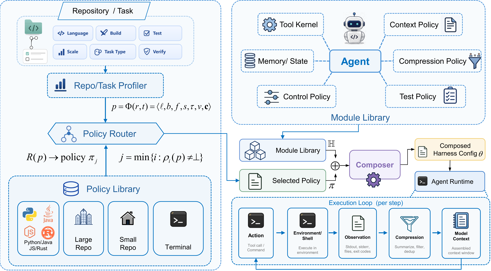
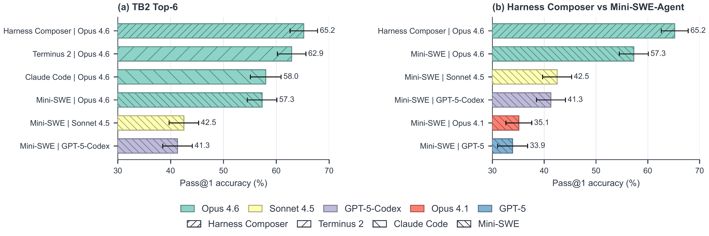
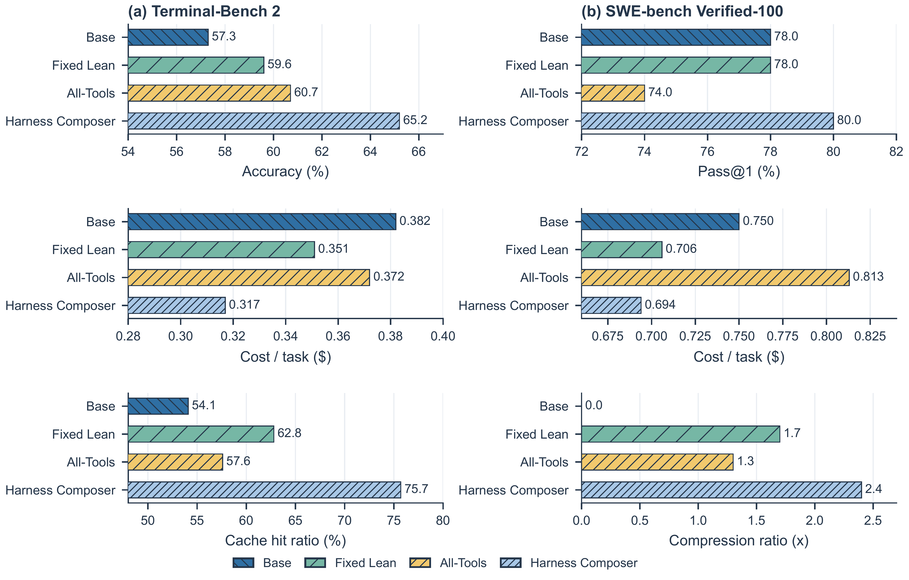

# Harness Composer

<div align="center">

**Repository-conditioned harness composition for software-engineering agents.**

[](https://www.python.org/)
[](#status)
[](https://github.com/SWE-agent/mini-swe-agent)
[](#verification)
[](#license)

</div>

Harness Composer is a lightweight framework for building lean, task-specific harnesses around
software-engineering agents. Instead of running every repository through one fixed prompt and tool
configuration, it profiles the repository and task, routes that profile to a modular policy, and
composes only the tools, context rules, test guidance, compression behavior, control limits, and
manifest metadata needed for that instance.

<p align="center">
  
</p>

```text
repo/task -> profile -> route policy -> compose config -> run mini-SWE-agent -> save manifest
```

## Why It Exists

Coding-agent performance depends on more than the base model. The surrounding harness determines
which files the model sees, which tools it can use, how tests are run, how long outputs are
compressed, and what state is preserved. Fixed harnesses can mismatch heterogeneous repositories.
All-tools harnesses can waste context and make failures hard to attribute.

Harness Composer tests a narrower, auditable alternative:

> A small typed library of harness modules can be composed from deterministic repo/task profiles,
> yielding better cost-performance trade-offs than fixed or all-tools harnesses.

## Headline Results

The results below are aggregate evaluation numbers for the current anonymous release. See
[RESULTS.md](RESULTS.md) for the full result tables and figure inventory.

| Benchmark | Base setting | Harness Composer | Accuracy gain | Cost change |
| --- | ---: | ---: | ---: | ---: |
| Terminal-Bench 2, Claude Opus 4.6 | 57.3 pass@1, USD 0.382/task | 65.2 pass@1, USD 0.317/task | +7.9 points | -17.0% |
| SWE-bench Verified-100, Claude Opus 4.6 | 78.0 pass@1, USD 0.750/task | 80.0 pass@1, USD 0.694/task | +2.0 points | -7.5% |

<p align="center">
  
</p>

<p align="center">
  
</p>

Key takeaways:

- On Terminal-Bench 2, Harness Composer reaches 65.2% pass@1 with Claude Opus 4.6, improving over
  the vanilla Mini-SWE-Agent baseline by 7.9 points.
- It reduces per-task cost from USD 0.382 to USD 0.317 while increasing input-token cache hit ratio
  from 54.1% to 75.7%.
- On SWE-bench Verified-100, it improves pass@1 from 78.0% to 80.0% while lowering per-task cost.
- Ablations show that profiling, routing, and observation compression each contribute to the final
  cost-performance trade-off.

## Core Components

| Component | Role |
| --- | --- |
| Repo/task profiler | Extracts language, build system, test framework, repository scale, task type, verification type, and context-risk flags. |
| Policy router | Applies deterministic rules over the profile and selects the first matching harness policy. |
| Module library | Stores typed modules for tools, context policy, test policy, compression, control, and memory/state. |
| Composer | Merges the selected policy with a Mini-SWE-Agent base config and writes a runnable YAML config. |
| Decision manifest | Records the profile, selected policy, routing reason, enabled modules, risks, and expected benefits for auditability. |

## Quick Start

Install the package in editable mode:

```powershell
python -m pip install -e .
```

Inspect a repository/task profile:

```powershell
harness-compose profile C:\path\to\repo `
  -t "Fix a failing pytest issue"
```

Compose a Mini-SWE-Agent config and decision manifest:

```powershell
harness-compose compose C:\path\to\repo `
  -t "Fix a failing pytest issue" `
  --task-id requests_smoke `
  -o harness.generated.yaml `
  -m decision_manifest.json `
  --print-manifest
```

Run Mini-SWE-Agent with the composed harness:

```powershell
mini -c harness.generated.yaml -y
```

The module entry point is also available directly:

```powershell
python -m minisweagent.harness_composer.cli compose C:\path\to\repo -t "..." -o harness.generated.yaml -m decision_manifest.json
```

## Policy Library

The prototype includes routed policies plus an all-tools ablation policy:

| Policy | Intended use |
| --- | --- |
| `terminal_task` | Terminal-oriented tasks where command execution and concise output handling matter most. |
| `python_pytest` | Python repositories with pytest-style verification. |
| `python_large_repo` | Larger Python repositories where search-first context management is important. |
| `small_repo_direct` | Small repositories where direct file inspection is cheaper than search-heavy routing. |
| `js_node` | JavaScript or Node.js projects with npm-style test output. |
| `go_static` | Go repositories with package-level navigation and static test output. |
| `fallback` | Conservative default when no specialized rule matches. |
| `all_tools` | Ablation baseline that exposes every module at once. |

## Project Layout

```text
src/minisweagent/harness_composer/
  profiler/          deterministic repository and task profiling
  router/            rule-based policy routing
  library/           YAML policies and prompt fragments
  composer/          config and manifest composition
  adapters/          Mini-SWE-Agent runtime adapter
  runtime/           observation compression helpers
  cli.py             profile and compose commands
tests/harness_composer/
assets/figures/      evaluation figures as PDF and GitHub-ready PNG
RESULTS.md           aggregate result tables for the anonymous release
```

## Status

This repository implements the Phase 0/1 research prototype:

- deterministic repo/task profiler;
- rule-based policy router;
- YAML policy library;
- prompt and config composer;
- decision manifest writer;
- optional runtime adapter for observation compression and repeated-command tracking;
- focused tests for profiler, router, policy loading, composer, and compression.

It intentionally does not implement learned routing, full self-evolution, arbitrary harness-code
search, or end-to-end harness optimization.

## Verification

Targeted tests used during the current prototype pass:

```powershell
python -m pytest tests\harness_composer tests\agents\test_init.py -q
```

Expected result:

```text
19 passed
```

## License

The package metadata declares the project under the MIT license. Harness Composer is built on top of
Mini-SWE-Agent and keeps the underlying `minisweagent` runtime package for compatibility.
